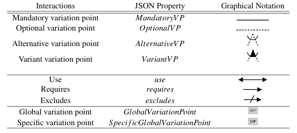

## Variability Model Generator

The Variability Model Generator was implemented to automatically generates variability models adapted to SeVataX models.
The tool takes into account the  interactions defined in the following table.

This tool lets the designer setup the number of variability models to be created, together with the number of services, variability points, dependencies, and levels for each of these models.
Also, designers can specify the number of inconsistencies or it can be setup as automatic.
Test cases used in the experiments are available from  `variabilityModelGenerator/tree/master/testCases`.

## Implementation

 Clone and/or download the project.

Define parameters in generator.py and run `ng serve` for a localhost implementation. Go to `http://localhost:4200/`.

#parameters

Number of Services (SQ): Indicating the number of different services to be created in the variability models.
Relation Complexity (RC): Indicating the number of different <<require>>, <<exclude>> and <<use>> dependencies  to be included in the variability models.

Model Levels (MP): Indicating the max level of each variation point from root to leafs.

Number of incompatibilities (IQ): Indicating the number of different incompatibilities to be added.

Example:

SQ = 30
RC = 5
MP = 4
IQ = 10

